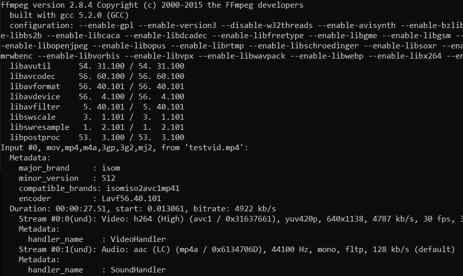

# ffmpeg notes

# **Useful Commands**

## View information about a video or audio file

### `ffmpeg -i testVideo.mp4` or `ffprobe testVideo.mp4`

This command will display details about the particular media file. For an audio file, `ffmpeg -i testAudioTrack.mp3`.

## Compress a video file

### `ffmpeg -i testVideo.mp4 -vf scale=1280:-1 -c:v libx264 -preset veryslow -crf 24 testVideoOutput.mp4`

This command will compress the video file. To reduce the video's file size, you can specify a preset using an argument like `-preset veryslow`. This command does not destroy or alter the original video file- you must specify an output file name and format, such as `testVideoOutput.mp4` in the example.

## Trim a video

### `ffmpeg -i testVideo.mp4 -ss 00:00:14 -codec copy -t 8 shortenedTestVideo.mp4`

This command will trim a video clip to a shorter time. It takes an input `-i` testVideo.mp4 and at `-ss` 00:00:14 creates an 8 second shortenedTestVideo.mp4. The flag `-ss` indicates the starting second of the clip, and `-t` indicates how long we want to trim the clip down to, in our case 8 seconds.

## Extract frames from a video

### `ffmpeg -i testVideo.mp4 -r 100 -f image2 image-%2d.png`

This command will create frames from a video. `-i` flags the input video. `-r` sets the framerate, i.e. 100 frames per second. `-f` sets the output format and creates the files. In this case, `testVideo.mp4` is 8 seconds long, at an `-r` of 100 it will extract and output **800** new images created from frames of the inputted video titled `image-01.png` all the way to approximately `image-800.png`.  

**To save space, you can also output images to `.bmp` file format.**

## Test/Preview video

### `ffplay testVideo.mp4`

This command will preview a video in your system's default player.

## Test/Preview audio track

### `ffplay testAudio.mp3`

This command will preview an audio track in your system's default player.

## Decrease video playback speed

### `ffmpeg -i testVideo.mp4 -vf "setpts=4.0*PTS" playbackDecreased.mp4`

This command will decrease the playback speed of a video. `"setpts=4.0*PTS"` To decrease the playback speed of a video, your must multiply by a number that is **greater than** 1, i.e. your value in `num*PTS"`.

## Increase video playback speed

### `ffmpeg -i testVideo.mp4 -vf "setpts=0.5*PTS" playbackIncreased.mp4`

This command will increase the playback speed of a video. `"setspts=0.5*PTS"` will double the speed of your video. To increase the speed of your video, you must multiply by a number **less than** 1, i.e. your value in `num*PTS`.

## Convert a video file to a different format

### `ffmpeg -t testVideo.mp4 outputVideo.avi`

This command will change the file format of the `-i` flagged video. `outputVideo.avi` is an argument with both the new file's name and file format.

## Change the resolution of a video

### `ffmpeg -i testVideo.mp4 -s 1280x720 -c:a copy testVideoOutput.mp4`

This command will change the resolution of a video. In this case it will set the resolution to 1280x720. You can use this to downscale 4K videos, or just to set an desired video resolution.
